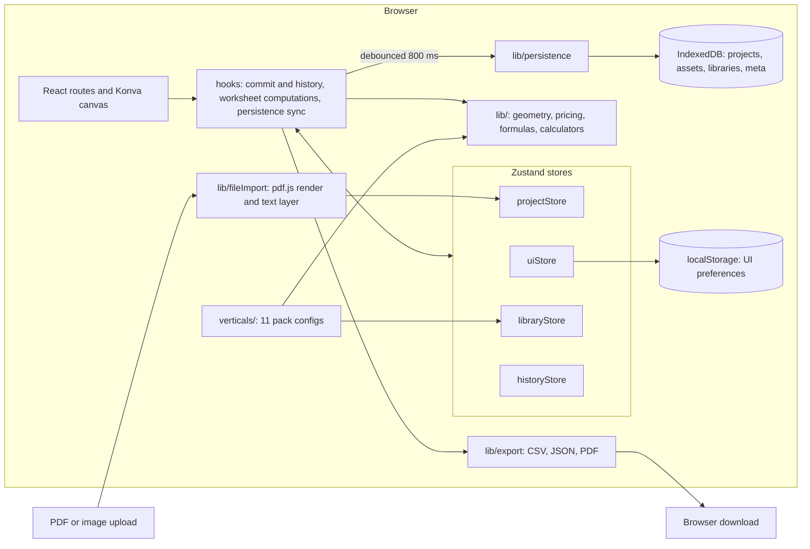

# Floorplan Takeoff: engineering showcase

## 1. One-paragraph summary

Floorplan Takeoff is a browser-based estimating tool for small UK trade businesses (flooring, painting, turf, fencing, paving, roofing, electrical, plumbing, solar, general building). A user uploads a floor plan, sets the scale by drawing a line of known length, traces areas, lengths, walls, volumes and counts, and gets priced line items and a branded proposal PDF. There is no backend and no account; everything lives in the user's browser. It is deployed as a public demo on Vercel. With no accounts and no analytics, I have no usage figures. The source is about 35,000 lines, plus 13,400 of unit tests and 6,700 of end-to-end tests.

## 2. The problem and the constraints that shaped the design

Dedicated takeoff software is priced for large contractors, and the costliest quoting error is a wrong scale, which silently skews every quantity.

- **Local-first.** `docs/PRODUCT_PLAN.md` records on 2026-07-12 that the editor must work with zero network and cost nothing to host. So every integrity guarantee has to live in the client.
- **Large binary inputs.** A plan page is a multi-megabyte bitmap. The first version stored base64 images in `localStorage` (a few megabytes of quota), so persistence moved to IndexedDB. Imported images are capped at 4,096 px.
- **No drift.** Quantities and prices depend on geometry, scale, units and scenario, so they are always recomputed from those.
- **Responsiveness.** A Playwright test pans a 1,000-item project and asserts more than 24 fps. I make no 60 fps claim.

## 3. Architecture



Four small Zustand stores hold project, UI, library and undo state. They contain plain setters. Every edit funnels through three functions (`commitMeasurements`, `commitMarkups`, `commitProjectChange` in `hooks/useHistoryActions.js`) that push an undo snapshot, then update the store. My architecture doc specified named store actions; this funnel is what exists.

**One run.** Upload renders each page with pdf.js and extracts positioned text. Two clicks and a typed length set `scaleByPage[pageId]` in metres per pixel. Each pointer move goes through `snapPoint` (close, points, midpoints, plan-bitmap lines, grid, guides). Finishing a shape calls `commitMeasurements`. `useWorksheetComputations` maps stored measurements to priced rows via `getMeasurementQuantity` and `computeRowPricing`, memoised on measurements, scales, units and scenario. After 800 ms of quiet, `saveProjectSnapshot` replaces page images with asset references and adjusts reference counts. A proposal export captures each page from the Konva stage and builds the PDF with pdf-lib.

## 4. Integrations

There are no network integrations: searching for `fetch(`, `XMLHttpRequest` and `sendBeacon` finds one `fetch` (a local page URL during PDF export), and no analytics code. The integrations are libraries and browser APIs, so authentication and rate limits don't apply.

| System | Provides | Failure handling | Isolation |
|---|---|---|---|
| IndexedDB (`idb`) | Persistence | A failed save shows a toast with a "Download backup" action; no retry | Only `db.ts` imports `idb` |
| pdf.js | Page render, text | A malformed text layer is caught; the page imports, the cross-check is absent | Only `fileImport.ts` |
| pdf-lib | Proposal and marked-up PDFs | A page that fails to capture is skipped with a warning | Three files, not fully isolated |
| polygon-clipping | Overlap, cut-out, panel geometry | Types and ESM build disagree (section 8) | Shim duplicated in three files |
| Konva | Canvas scene graph | Untestable in jsdom | 11 non-test files |

There are no retries or circuit breakers because nothing is remote. `docs/ARCHITECTURE.md` section 8 designs backoff for a future backend; none of it is built.

## 5. Data model

IndexedDB database `takeoff` has four stores. `projects` holds one record per project: `schemaVersion` (6), the plan with pages as asset references, measurements, markups, `scaleByPage`, scale regions, adjustments, scenarios, a copy of the price book, proposal settings, quote-status history and `previousSave`. `assets` holds `{id, blob, mimeType, refCount}`. `libraries` holds one app-wide record of presets, cost codes, suppliers, price books, company profile and proposal templates. `meta` holds the last-open project.

- Stored lengths are metres; scale is metres per pixel per page. Changing scale never edits geometry.
- A measurement stores geometry and pricing inputs, not quantity or totals (counts excepted).
- Libraries are copy-on-use, so editing a price book never changes an old quote.
- `previousSave` keeps one save back for rollback.
- `grandTotal` is also stored for the dashboard list, computed at save time by `computeProjectGrandTotal` from the same pricing helpers as the worksheet.

## 6. Key design decisions

1. **Local-first, no backend.** *Alternatives:* a hosted app with accounts. *Why:* instant demo, free hosting, offline use. *Trade-off:* no sync, backup or sharing; browser storage limits; all validation is client-side.
2. **Store inputs, derive outputs.** *Alternatives:* persist computed totals. *Why:* a scale, unit or scenario change re-prices everything consistently. *Trade-off:* recomputation, kept cheap by memoisation.
3. **Page images as reference-counted blobs outside the project record.** *Alternatives:* base64 inside the record, as the first version did. *Why:* autosave doesn't rewrite multi-megabyte images, and duplicates and rollbacks share blobs. *Trade-off:* manual reference counting where each adjustment is its own transaction, so a crash mid-save can leave counts wrong. Section 7 is a bug in this area.
4. **Trades as data, calculators as pure modules.** *Alternatives:* per-trade code branches. *Why:* a trade is one config file (11 exist), and pack validation rejects any that names a calculator that doesn't exist (three do). *Trade-off:* the config schema keeps growing.
5. **Snapshot undo, capped at 30.** *Alternatives:* a command or patch log. *Why:* simplest correct model; snapshots are compared without stringifying page images. *Trade-off:* memory per snapshot and a JSON comparison of measurements on every commit.
6. **Tolerant read-side normalisation, not a versioned migration runner.** *Alternatives:* ordered migrations keyed on `schemaVersion`, which my architecture doc specified. *Why:* most changes were additive, so normalisers default absent fields. *Trade-off:* no downgrade path, and committed fixtures exist only for v1, v2 and v4.

## 7. One integration or data-quality problem solved (STARR)

**Situation.** A new plan revision replaces `plan.previousPages` wholesale. Each save also rolls the old record into `previousSave`, claiming a reference on its page assets. A blob is deleted only when its count reaches zero.

**Task.** A post-Phase-6 audit (2026-08-03, commit `ad0daad`) asked whether any sequence of saves could strand a blob nothing references.

**Action.** The audit traced four successive revision uploads by hand with exact counts. An asset from two revisions back stayed at count 1 forever: it had dropped out of `previousPages` and nothing released it. The fix releases assets that left `previousPages`, placed after the claim for `previousSave`. Order matters: releasing first can take a shared asset through zero and delete a blob still in use, and a later claim on a deleted id is a silent no-op.

**Result.** Storage is bounded across revisions. Nobody measured how much a real user would have leaked; the evidence is the trace and the test.

**Regression test.** `src/lib/persistence/projectPersistence.test.ts`, "releases an asset once it's fallen out of both plan and previousSave after repeated revision uploads". It runs four saves through the IndexedDB API and asserts every asset's exact count. With the release step disabled the test fails; restored, all 73 tests in the file pass.

## 8. Testing and verification

- **Unit (Vitest, jsdom): 1,210 tests in 79 files.** Pure logic, persistence against `fake-indexeddb`, and React component tests.
- **End-to-end (Playwright, Chromium): 281 tests in 30 files**, against the production build: workflows, accessibility (axe), layout at phone, tablet and desktop widths, and the 1,000-item performance project.
- **CI** (`.github/workflows/ci.yml`): lint, typecheck, unit tests, build, then Playwright.
- **Not mocked.** There is no `vi.mock(` anywhere; 15 files use spies or stubs. Unit tests use a spec-conformant in-memory IndexedDB, end-to-end tests use Chromium's real one, and the proposal test downloads the real PDF and extracts its text with pdf.js.
- **Why jsdom can't cover Konva.** Konva draws to a canvas bitmap that the DOM can't inspect, so canvas behaviour is checked through what the DOM shows: quantity readouts and messages.

**Bugs only a real browser caught.** On 2026-09-30 I changed calibration to ask for the length after the line is drawn (commit `6eb1c7c`). All unit tests passed, but Playwright showed Enter didn't set the scale: the browser's own mousedown handling took focus from the new field, and the pre-filled length arrived a render late, so Enter could confirm an empty value. Separately, `polygon-clipping` type-checked and passed every unit test but failed `vite build`, because its types declare named exports its ESM build lacks (commit `47ce359`).

```sh
cd frontend
npm run test                    # 1,210 tests, 79 files
npx playwright test --list      # 281 tests in 30 files
npm run build && npx playwright test
```

## 9. Security and deployment

- **Auth and secrets.** No accounts, no server, no API keys in the client, no tracked `.env` files. The only variable the code reads is an optional `VITE_API_URL` flag.
- **Hosting and CI.** Vercel serves the static build (`vercel.json` holds only rewrites). CI is GitHub Actions.
- **No backend yet.** The repo contains no server code. Phase 8 (`docs/ARCHITECTURE.md` section 8) designs a FastAPI service with Postgres and object storage for share links with online acceptance, cloud backup, aerial-imagery and solar-yield proxies, and lead capture. It is a design, not built.
- **Known gaps.**
  - `npm audit --omit=dev` reports 3 high-severity advisories. `pdfjs-dist` 5.7.284: arbitrary JavaScript execution when opening a malicious PDF, which matters because the app opens user PDFs; the fix is a major upgrade. `react-router` and `react-router-dom` 7.18.1: an RSC-mode CSRF bypass; the app doesn't use RSC mode, and a non-breaking fix exists.
  - No Content-Security-Policy or other security headers.
  - IndexedDB data is unencrypted.
  - Project JSON import is validated by tolerant normalisation, not a strict schema.

## 10. Code excerpt

```ts
const PROXIMITY_FRACTION = 0.03;     // of the page diagonal
const MAX_ANGLE_DIFFERENCE_DEG = 12; // dimension text runs parallel to what it measures
const AMBIGUITY_MARGIN = 1.4;        // candidates this close are a coin flip

export function findDimensionMatch(
  edgeStart: Point, edgeEnd: Point, candidates: PositionedText[], page: { width: number; height: number },
): DimensionMatch | null {
  const edgeLength = Math.hypot(edgeEnd.x - edgeStart.x, edgeEnd.y - edgeStart.y);
  if (edgeLength < 1) return null;
  const maxDistance = Math.hypot(page.width, page.height) * PROXIMITY_FRACTION;
  const edgeAngle = (Math.atan2(edgeEnd.y - edgeStart.y, edgeEnd.x - edgeStart.x) * 180) / Math.PI;

  const scored: DimensionMatch[] = [];
  for (const candidate of candidates) {
    const metres = parseDimensionText(candidate.text);
    if (metres === null || metres <= 0) continue;
    if (angleDifference(candidate.angleDeg, edgeAngle) > MAX_ANGLE_DIFFERENCE_DEG) continue;
    const distancePx = pointToSegmentDistance(candidate, edgeStart, edgeEnd);
    if (distancePx > maxDistance) continue;
    scored.push({ text: candidate.text.trim(), metres, distancePx });
  }
  if (!scored.length) return null;
  scored.sort((a, b) => a.distancePx - b.distancePx);
  if (scored.length > 1) {
    const [best, runnerUp] = scored;
    const tooCloseToCall = best.distancePx * AMBIGUITY_MARGIN > runnerUp.distancePx;
    const disagree = Math.abs(best.metres - runnerUp.metres) > 0.01;
    if (tooCloseToCall && disagree) return null;
  }
  return scored[0];
}
```

This is the core of the printed-dimension cross-check (`lib/dimensionText.ts`, shipped 2026-08-26): it pairs a traced edge with the dimension printed beside it on the drawing, so a wrong scale can be flagged. It returns null for "nothing near", "nothing parallel" and "two candidates too close to call", because a confident wrong warning is worse than none. Two candidates naming the same length aren't ambiguous, so that case still matches.

## 11. What I'd do next / known limitations

- Upgrade `pdfjs-dist` (with its tests) and apply the `react-router` fix.
- Make reference counting robust: one transaction per save, or a periodic sweep recomputing counts from the projects.
- The cross-check works only in the session where a text-layer PDF was uploaded, because the extracted text is deliberately not persisted. It does nothing for scanned plans.
- `Workspace.jsx` is 3,148 lines, far past the 400-line limit my architecture doc set, and hooks and several components are still untyped JavaScript.
- The per-row pricing loop is written out three times (worksheet hook, `computeProjectGrandTotal`, proposal builder). It has drifted apart before.
- Schema fixtures are missing for v3, v5 and v6, and the `polygon-clipping` shim should live in one module.
