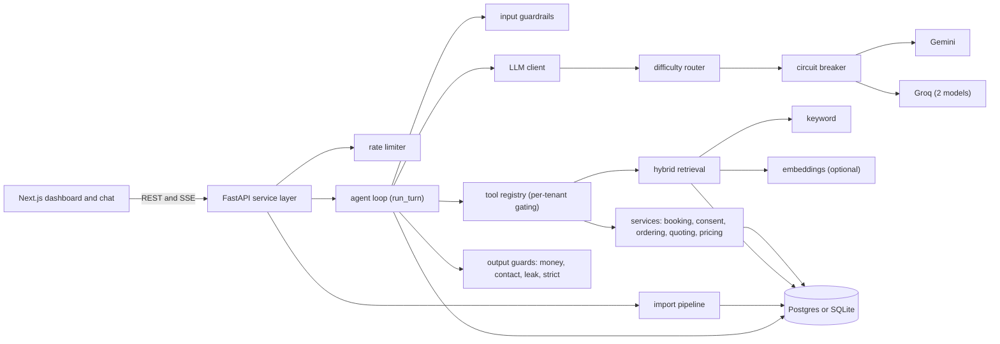

# Recepto: backend write-up
**Live:** [receptio-v3.vercel.app](https://receptio-v3.vercel.app) (free-tier demo; the first request after idle can take a minute)

## 1. Summary

Recepto is a multi-tenant backend for an AI receptionist aimed at small service businesses. A business configures an agent with its menu, hours and documents; the agent answers questions, books appointments, takes orders, takes messages and escalates. It is a FastAPI service over Postgres/SQLAlchemy with a tool-calling agent loop, a multi-provider LLM chain, hybrid retrieval and an import pipeline.

**Status: working demo, not production.** It is deployed on free tiers (Render, Neon Postgres, Vercel); `/health` returned HTTP 200 on 2026-10-01 after a first request timed out, consistent with a cold start. It has no authentication (section 9). 129 commits, 2026-06-29 to 2026-09-02.

## 2. The problem and the constraints that shaped the design

A chat agent can absorb repeated customer questions, but a language model can state a wrong price, invent a booking or claim an action it never took. The design treats model output as untrusted.

- **No paid runtime services.** Free LLM tiers rate-limit, time out, return empty completions and retire model ids without notice.
- **Free hosting sleeps and has an ephemeral disk**, hence Postgres.
- **Free models are weak at arithmetic and at obeying prompts**, so rules that matter live in code: tools compute totals and dates, and guards sit on the output.
- **English only**, by choice.

## 3. Architecture



**One chat turn** (`POST /conversations/{id}/messages`, plus an SSE `/stream` variant):

1. A per-conversation rate limit applies (30 per minute by default).
2. `run_turn` screens the input (a crisis message short-circuits with no model call), updates the conversation memory, and builds the prompt from hours, menu, known facts and cart, offering only the tools that tenant enabled.
3. The loop runs up to 6 model rounds. `execute_tool` refuses any tool outside the tenant's set. Dates, availability and totals come from tool code.
4. A candidate reply is checked for an empty promise, an unbacked price, address or phone number, a false "it isn't documented" and a leaked tool name. A failure earns one private nudge to the model; an unbacked price or address that survives it, or a reply still naming an internal tool, is replaced by a fixed deflection.
5. The reply and a **receipt** are persisted: sources cited, money verdict, what was blocked, tools run (queries masked per tenant privacy setting).

## 4. Integrations

| System | Failure modes | Isolation |
|---|---|---|
| Gemini and Groq chat (OpenAI-compatible, API key) | 429s, timeouts, empty completions, retired models | One config file, one client path, breaker (below) |
| Gemini embeddings (REST, API key) | Rate limit, outage, retired model | `embed()` returns `None`; retrieval falls back to keyword; status on `/health` |
| Target web page, then `r.jina.ai` reader (no auth) | 403s, JS-only pages, thin renders | Browser headers and JSON-LD first, reader fallback, 4 tries with backoff, 5 MB cap |
| Nominatim, postcodes.io, gov.uk bank holidays (no auth) | Fair-use limits, outage | Caches (failures too), injectable `_http_get`; failure means "ask the caller" |
| Outbound webhook (env URL) | Endpoint down | Background thread, 5 s timeout, errors swallowed |

**Provider chain.** `llm/client.py` tries legs in order. A leg that raises is benched for a cooldown (45 s default), and so is one that answers slower than 12 s: on a live call a 52-second answer is indistinguishable from a hang-up. Each call has an 18 s deadline. An empty completion counts as a failed leg but is not benched. If every leg is benched, all are tried anyway, so the breaker never refuses service.

## 5. Data model

Fourteen tables (`app/models.py`):

- **`Organization` to `Agent`.** An agent is the tenant; tenant-owned rows carry `agent_id`. `Agent.settings` is JSON with five allow-listed groups, and a PATCH replaces only the groups it names.
- **`Service`** is the structured menu with a pricing model (flat, tiered, quote-only, free, per-unit), so booking can only confirm something real.
- **`Embedding`, `DocQuestion`.** Vectors are optional and rewritten on a different schedule, so they have their own tables. Each records the `variant` (model, dimensions, task type) that made it, because vectors from different configurations are not comparable.
- **`Conversation.memory`** is a JSON "known so far" document, so a long call can drop old messages without losing facts.
- **`Task`** holds bookings, messages and escalations as typed rows with a JSON payload.
- **`Receipt`** records the agent's conduct apart from the transcript, so transcripts can be purged without destroying the audit trail.

Schema changes are additive only: `create_all` plus a hand-written `ALTER TABLE ADD COLUMN` list. There is no Alembic.

## 6. Key design decisions

**1. Output guards replace the reply, not just flag it.**
*Alternatives:* prompt rules; advisory annotation; model-based judging.
*Why:* an automated test caller caught the agent quoting two real prices, then volunteering a total that existed nowhere in the data. Flagging that and still saying it was not acceptable.
*Trade-off:* the checks cover money, postcodes, phone numbers, emails and URLs, not prose such as hours or policies (outside strict mode). Containment matching accepts coincidences ("£45" is grounded by "£145").

**2. A difficulty-ordered fallback chain.**
*Alternatives:* a static latency-ordered chain (the original); a paid model (ruled out).
*Why:* a staff-assistant conversation denied five times that an address was documented. Every failure came from the fast "lite" leg; the 120B leg answered the same question correctly 6 of 6 times, with the same retrieved document. The router now puts larger models first on hard turns (active booking or order, a tool already run, a strict tenant).
*Trade-off:* it matches parameter counts in model-id strings, a heuristic; an unrecognised id lands in the middle tier.

**3. Reciprocal Rank Fusion for hybrid retrieval.**
*Alternatives:* a `0.5 × keyword + 0.5 × cosine` sum (shipped first); a keyword score floor.
*Why:* a hit count and a cosine are on incompatible scales; RRF fuses ranks and needs no weighting. Every keyword-floor threshold I measured broke real single-term matches.
*Trade-off:* on 65 to 71 labelled queries the semantic scores had no clean gap between right and wrong matches. The 0.65 floor is a compromise; residual false hits are left to the output guards.

**4. Import is preview, then commit.**
*Alternatives:* write on upload.
*Why:* `preview` is read-only; it marks items new or update and shows before-and-after for destructive agent fields. `commit` is idempotent by case-insensitive name or title, in one transaction. A model-drafted price is kept only if that figure appears in the source text.
*Trade-off:* this catches an invented price but not a mis-paired one. Given "Balayage £110 / Cut £45", a draft saying Balayage costs £45 is kept, because 45 is in the source.

## 7. A data-quality problem solved

**Situation.** On 2026-08-05, while writing tests for chunked PDF uploads, a strict-mode test failed intermittently. Clearing `__pycache__` seemed to fix it.

**Task.** Find why, and whether the shipped money guard was involved.

**Action.** I looked for what varied: the test passed only when a stray digit happened to be in the evidence. The money regex stopped at a thousands comma, so "£9,999" was read as "£9", and the guard checked whether "9" appeared anywhere in the evidence. I reproduced it by swapping the old pattern into the current module:

```text
Columns 2-3: ungrounded("That will be £9,999.", evidence)
          figures("about £3,100 all in")   evidence "we have 9 rooms"   evidence "we have rooms"
pre-fix   ['£3']                           [] (clean, wrong)            ['£9']
post-fix  ['£3,100']                       ['£9,999']                   ['£9,999']
```

**Result.** An invented four-figure price passed whenever a matching digit was in the evidence. An existing test ("thousands separators match either way round") had been passing for the wrong reason, because the truncated token matched anything. Commit `657c73b` adds `(?:,\d{3})*` to the money and number patterns. I did not measure whether any live reply was affected.

**Regression test** (`dev_conversation.py`, with companion checks in `dev_facts.py`):

```python
check("a comma'd price is read in FULL, not truncated at the comma",
      grounding.figures("about £3,100 all in") == ["£3,100"])
check("an INVENTED four-figure price is caught even when a stray digit matches",
      grounding.ungrounded("That will be £9,999.", "we have 9 rooms") == ["£9,999"])
```

## 8. Testing and verification

- **Deterministic suites:** 16 `dev_*.py` files, 1,490 checks (9.7k lines of test code, 15.9k of application code), on a throwaway SQLite database with no network.
- **Live harnesses, run by hand:** `dev_chain.py` probes each provider leg; `eval_retrieval.py` scores retrieval on 113 labelled queries over five demo tenants; a "mystery shopper" (an LLM playing a caller, graded by deterministic checks) is an endpoint.

**Not mocked:** the database, services, guards and agent loop. **Mocked:** the LLM (scripted replies injected at `llm.complete` and `llm.stream_completion`) and HTTP (`urlopen`, `_http_get`).

**A bug only live testing found.** Commit `a070bf8` (2026-08-06): `embed()` reused one variable name for the API key and the per-text cache key, so the cache key went out as `?key=`. Every live call failed, the module swallows errors by design, and retrieval silently ran keyword-only for weeks while all 823 tests passed, because they inject a fake embedder. The regression test now inspects the outgoing URL, and `/health` reports embedder failures.

## 9. Security and deployment

- **Authentication: none.** All 46 routes are open and tenant isolation is by id only. Anyone with the URL can read customers and transcripts, edit settings or delete data. I deferred auth while I was the only user; this is the main reason it is a demo.
- **Rate limiting** is in-process and keyed by conversation id, so new conversations bypass it. **CORS** defaults to `*`.
- **Secrets** come from environment variables: `.env` is git-ignored and `.env.example` holds placeholders. A scan of all 129 commits for Gemini, Groq and OpenRouter key patterns and password-bearing database URLs found none (a known-present control string confirmed the scan can match). The Gemini embeddings key travels as a URL query parameter, which can appear in logs.
- **URL import** blocks literal private hostnames and IP prefixes only, with no DNS or redirect check, so it is not an SSRF defence. The import upload endpoint has no size cap.
- **Hosting:** Docker on Render, Postgres on Neon, frontend on Vercel; `/health` reports the deployed commit. **CI: none**; tests run by hand.

## 10. Code excerpt

```python
def complete(system, messages, tools, *, hard=False):
    """One LLM turn with tools. An empty completion falls through without benching."""
    providers = router.order_providers(active_providers(), hard=hard)
    _require(providers)

    global last_provider
    full = [{"role": "system", "content": system}, *messages]
    last_error = None
    empty_msg = None
    for provider in _healthy(providers):
        try:
            started = time.time()
            resp = _client(provider).chat.completions.create(
                model=provider["model"],
                messages=full,
                tools=tools,
                max_tokens=1024,
                temperature=0.3,
                timeout=_timeout_seconds(),
            )
            _note_latency(provider, time.time() - started)
            msg = resp.choices[0].message
            if _is_empty(msg):
                empty_msg = msg
                last_provider = provider["label"]
                continue
            last_provider = provider["label"]
            return msg
        except Exception as e:  # rate limit / bad key / transport -> bench + next provider
            _bench(provider)
            last_error = e
    if empty_msg is not None:
        return empty_msg
    raise RuntimeError(f"All LLM providers failed. Last error: {last_error}")
```

This is the single place a model is called with tools, so every fault policy lives here. It treats an empty completion as a failed leg without benching it, because free providers return empty content under throttling far more often than they raise. If every leg is empty it returns the last empty message so the core's recovery ladder can respond. The docstring is shortened; the body is unchanged.

## 11. What I'd do next, and known limitations

- **Auth and ownership first**: login, a user-to-tenant model and per-route checks. Then a shared rate limiter and SSRF checks.
- **Bookings are database rows, not calendar writes.** Double-booking is prevented by an application-level capacity check with no row lock or unique constraint, so concurrent requests could race.
- **CI, and Postgres in the tests.** The suites run on SQLite only. Replace the `ALTER` list with Alembic.
- **Guard coverage.** Prose claims are checked only in strict mode, and import should check that each price sits on its item's row.
- **Model drift.** A probe on 2026-08-20 found five of seven configured legs dead; nothing re-probes the chain on a schedule (`dev_chain.py` does it by hand).
