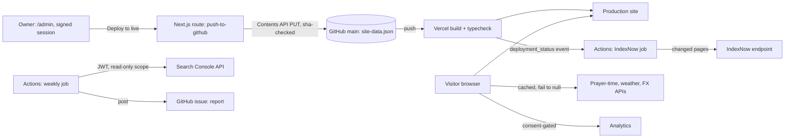

# Pilgrimage-travel agency website: integration showcase

Figures were true at the time of writing; section 8 gives the commands that reproduce them.

## 1. Summary

A content-managed website for a small travel agency that sells pilgrimage packages, built with Next.js 15 and TypeScript. The owner edits packages, prices, seat counts and page copy in an admin panel and publishes with one button. The site also pulls in live data (prayer times, weather, exchange rates), notifies search engines when pages change, and produces a weekly search-performance report. It is **live in production**; the source repository is private.

## 2. The problem and the constraints

A non-technical owner changes content several times a week, with no developer on call. Constraints: **free tiers only**; **accuracy over completeness** (a wrong price or prayer time is worse than "unavailable"); **truthful search metadata**; **unreliable third-party APIs with usage terms**, so the site must degrade rather than break; and **one operator**, so anything automatable should be.

## 3. Architecture



**One publish, end to end.** The admin keeps an editable copy of the whole config in the browser. "Deploy to live" POSTs it to a server route, which re-verifies the session cookie, caps the body at 2 MB, checks six required top-level keys, reads the current file's SHA and PUTs the new content with it (GitHub should reject a write against a stale SHA; I have not tested that path). The commit lands on `main`; Vercel builds and deploys (one observed run: about two minutes). When Vercel reports the deployment, a workflow finds the previous *successful* deployment through the Deployments API, fingerprints each page's inputs at both commits, confirms the IndexNow key file is reachable, and submits only pages that differ. The first production run finished about 15 seconds after the deployment status (HTTP 202).

## 4. Integrations

| System | Auth, limits | Failure handling and isolation |
|---|---|---|
| GitHub Contents API (write) | Server-only token; repo and branch from env | One PUT, so no partial write; non-2xx becomes a 502 with the upstream status; one route |
| GitHub Deployments / Issues | Workflow token, `deployments: read`, `issues: write` | IndexNow job warns and exits 0, so it can't block a release; the report job exits 1 with an annotation |
| Search Console API | Service account; RS256 JWT via `node:crypto`, read-only scope, no SDK; `rowLimit` 5000 | Periods end 3 days ago (recent data isn't final); no retry or pagination (section 11) |
| IndexNow | Key file at the site root | Checks the key file first; 15–20 s timeouts; any status other than 200/202 is a warning |
| Vercel edge geo headers | Request headers | Absent locally or if blocked; the page falls back to a default location |
| Prayer-time API | Keyless | 8 s timeout; HTTP error, bad shape or a missing prayer returns `null`; a device-side calculation keeps the home page populated |
| Weather (national met service) | Keyless; terms: honour `Expires`, truncate coordinates | 30-minute minimum cache; 403/429 stops calls for that session; failures carry a typed reason |
| Exchange rates (two APIs) | Keyless | Plausibility bounds, second source, last-good cache (max 3 days, shown with its date), then `null`; no hard-coded rate |
| Analytics (GA4) | Public measurement ID | Denied by default for EEA/UK/CH visitors; stored choice wins; off on `/admin`; live host only |

The prayer-time, weather and rate clients take an injectable `fetch`, so tests exercise each failure path.

## 5. Data model

There is no database: one typed JSON document (53 top-level keys, about 127 KB) in git, plus generated artefacts.

- **Packages:** a variant has `name`, `duration`, `roomPrices[]` (room type plus PKR/USD/GBP strings), `itinerary[]`, `zone`. Prices stay as the display strings the owner types and are parsed on demand: simple to edit, but parsing can fail, so an unparseable price becomes "no price", never zero.
- **Sections:** each page has `{enabled, order}` per section, so the owner can hide and reorder without code.
- **`page-inputs.ts`:** route → `{files[], data[]}`, the source files and config slices each page is built from.
- **`page-dates.json`:** route → `{hash, lastModified}`; a date changes only when the page's content hash does.

## 6. Key design decisions

**1. Content in a git-tracked JSON file, not a database.** *Alternatives:* hosted Postgres, a headless CMS. *Why:* one editor, low write rate, every change is a commit (audit, rollback by revert), no runtime database dependency. *Trade-off:* publishing needs a rebuild, and the admin writes the whole document, so a stale browser copy could overwrite newer content; a `configVersion` timestamp makes older copies discard themselves.

**2. Sitemap dates from content fingerprints.** *Alternatives:* build time (the earlier behaviour: every page claimed "changed now"), git file dates (wrong when one JSON file feeds every page). *Why:* a SHA-256 over each page's source files and config slices, line endings normalised, seeded from git history where the change is committed. A page changed since its recorded date gets no date rather than a guess. *Trade-off:* inputs are listed by hand, guarded by a regex-based test that can miss indirect reads.

**3. IndexNow after go-live, not in the build.** *Alternatives:* a post-build script. *Why:* at build time the new version isn't live, the key file isn't served on a first deploy, and a build must not fail over a notification. Comparing against the last *successful* deployment means a failed deploy's changes are still submitted later. *Trade-off:* depends on GitHub receiving Vercel's deployment events.

**4. Return `null`, never a plausible guess.** *Alternatives:* a hard-coded fallback rate, a server-side cache. *Why:* wrong figures on a booking page cost trust. *Trade-off:* visitors sometimes see "unavailable", and caches are per browser, so providers' limits fall on users, not a proxy.

**5. The weekly report is a GitHub issue, not commits or an automated editor.** *Alternatives:* pull requests, an LLM API. *Why:* free; commits to `main` would trigger production deploys; a human decides what to change. *Trade-off:* no history beyond closed issues; the heuristics (an assumed click-through-by-position curve) are crude.

**6. Signed stateless admin sessions.** *Alternatives:* a session store. *Why:* HMAC-SHA256 over `v1.<expiry>` via Web Crypto behaves identically in edge middleware and Node routes. *Trade-off:* no server-side revocation except rotating the secret.

## 7. A data-quality problem solved (STARR)

**Situation.** The first run of the weekly report on real Search Console data listed the contact page three times (551, 55 and 12 impressions) and flagged a page at position 78 as "seen but rarely clicked".

**Task.** Count each page once, and stop flagging pages nobody could be expected to click.

**Action.** Search Console returns one row per URL variant. I added `mergeByPath`, which sums clicks and impressions per path and weights position by impressions instead of averaging it. A new section lists traffic still arriving on non-canonical addresses, and the click-through check now only judges pages at position 20 or better.

**Result.** Re-running the job on the same live property merged the three rows into one (618 = 551 + 55 + 12) and the position-78 false positive disappeared.

**Guard.** Two tests in `tests/companion/seo-report.test.ts`: one page under several addresses is counted once (asserting the impression-weighted position), and the click-through check only judges pages 1–2.

## 8. Testing and verification

- **Unit tests:** Node's built-in runner, 27 files, 289 tests, 0 failing at the time of writing.
- **Guard tests read the real repository:** no price typed into the home-page doors component; every page's fingerprint inputs cover the config keys its code reads; committed dates match current content.
- **Browser checks:** about 16 ad-hoc Puppeteer suites at phone, tablet and desktop widths, plus Lighthouse in Chrome DevTools, run before releases and on the live site. **The scripts are not in the repository**, which is a gap.
- **Not mocked:** the search integration was verified against the real API from a throwaway CI workflow, and IndexNow selection was dry-run against real deployment history before it sent anything. Unit tests do mock `fetch`, so they don't prove provider behaviour. A 63-date prayer-time sweep against the live API was run once, uncommitted; five dates remain as oracle values.
- **A bug only a real browser caught:** a probe with JavaScript disabled found every page blank. The theme boot script hides `<html>` until it runs, and nothing revealed it without JS. A `<noscript>` style now does.

Reproduce: `npm run test:companion`; `ls tests/companion/*.test.ts | wc -l`; `git log --oneline --invert-grep --grep="admin published site config" | wc -l` (175 commits excluding automated publishes).

## 9. Security and deployment

- **Admin auth:** `timingSafeEqual` over SHA-256 digests, a 750 ms delay on failure; HttpOnly, SameSite=Strict, Secure cookie valid 8 hours. Middleware guards `/admin/*` and the deploy route re-verifies the session itself. Signing fails closed without a secret.
- **Secrets** live in hosting and CI secret stores; `.env*` is git-ignored and `.env.example` lists names only.
- **Hosting/CI:** a push to `main` deploys to production; the build type-checks and doesn't ignore errors.
- **Known gaps:** no login rate limiting beyond the delay; no Content-Security-Policy; **tests don't run in CI**; JSON-LD is serialised without escaping `<` on all but one page, so admin-entered text containing `</script>` could break out of the tag (only authenticated admins can enter text, but it should be fixed). An admin credential was also once committed in an earlier branch history and has since been rotated; that history is kept privately and must not be published.

## 10. Code excerpt

```ts
export async function fetchForecast(
  lat: number,
  lon: number,
  timeZone: string,
  fetcher: typeof fetch = fetch,
  now: Date = new Date()
): Promise<ForecastResult> {
  let response: Response;
  try {
    response = await fetcher(`https://api.met.no/weatherapi/locationforecast/2.0/compact?lat=${trunc4(lat)}&lon=${trunc4(lon)}`);
  } catch {
    return { ok: false, reason: "network" };
  }
  if (response.status === 403 || response.status === 429) return { ok: false, reason: "blocked" };
  if (!response.ok) return { ok: false, reason: "network" };

  let value: WeatherSummary | null = null;
  try {
    value = summariseForecast(await response.json(), timeZone);
  } catch {
    value = null;
  }
  if (!value) return { ok: false, reason: "bad-data" };

  const asked = Date.parse(response.headers.get("expires") ?? "");
  const expiresAt = Math.max(Number.isFinite(asked) ? asked : 0, now.getTime() + MIN_TTL_MS);
  return { ok: true, value, expiresAt };
}
```

This is the weather provider's client. The provider's terms (cache until `Expires`, truncated coordinates, throttling without notice) are part of the contract, so the function returns a typed reason for each failure and a conservative expiry instead of throwing. The caller can back off on "blocked", and the injectable `fetcher` lets tests drive every branch. It uses two helpers not shown: `trunc4` (truncation to four decimals) and `summariseForecast` (payload validation).

## 11. What I'd do next / known limitations

- Run tests and a build in CI before deploy, and commit the browser checks.
- Escape `<` in all JSON-LD output, with a test; add login rate limiting and a Content-Security-Policy.
- Add retry/backoff and pagination to the Search Console job (a large site would exceed 5000 rows).
- Put rate and weather calls behind a small cached server endpoint so provider limits are shared.
- Validate the published config against a schema, not six top-level keys.
- Replace the regex check of which config a page reads with a typed accessor, so a missed dependency fails to compile.
