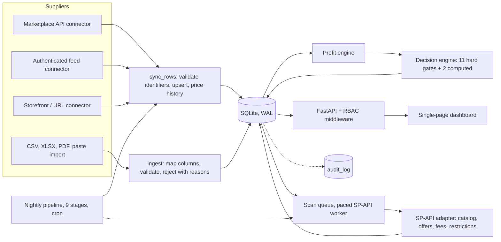

# UK wholesale sourcing tool: supplier ingestion to Amazon decisions

## 1. Summary

A single-operator tool that helps a small UK Amazon-FBA business decide which wholesale products are safe to buy. It ingests supplier catalogues through several connector types behind one sync pipeline, normalises them into SQLite, matches products to Amazon listings through the Selling Partner API (SP-API), computes profit with a real fee model, and runs every product through a gate-based decision engine that produces GREEN / AMBER / RED / WATCHLIST / NOT_ENOUGH_DATA. It is in private production use (one VM, one operator), not a multi-tenant product. About 24.6k lines of Python in the application package plus 23.2k lines of tests; 248 commits from 2026-07-09 to 2026-10-01.

## 2. The problem and the constraints that shaped the design

Margins are thin and the costly failures are quiet: a product looks profitable because one input is wrong.

- **Missing data must never look like a good result.** A profit figure without a real Amazon fee is stored as incomplete and cannot pass a gate.
- **Sources disagree.** Supplier feeds, Amazon catalogue data and listing titles contradict each other, so uncertainty is a first-class value.
- **Rate limits set the throughput.** The binding SP-API call allows 0.5 requests per second, so work is paced and prioritised.
- **Suppliers are uneven.** Some offer authenticated APIs, some are storefronts, some are CSV exports.

## 3. Architecture



**One pipeline run.** Cron starts the nightly pipeline (`automation.py`): `supplier_sync` → `queue_unmatched` → `scan` → `refresh_catalogue` → `refresh_bsr` → `refresh_fees` → `verify_supplier_offers` → `redecide` → `health`. Each stage is wrapped so one failure cannot stop the next; a run with failures is recorded PARTIAL. Sync validates barcodes, upserts products and appends a price-history row when cost or stock changes. Unmatched products are queued; the worker writes an `amazon_candidates` row, fetches offers, fees and listing restrictions, and inserts a `profit_scenarios` row. `redecide` re-evaluates changed products and appends a `decisions` row holding the full reasoning trace.

## 4. Integrations

**Amazon SP-API.** A Login-with-Amazon refresh token is exchanged for an access token sent in `x-amz-access-token`; the client implements no AWS request signing. Rate limits recorded in the project's deployment notes: offers 0.5 req/s (batch form: 20 ASINs per call at 0.1 req/s), fees 1 req/s, catalogue 2 req/s. 429 and 5xx are retried up to four times honouring `Retry-After` (capped at 12 s); the fees API reports some errors inside a 200 body, so it has its own retry.

**Supplier connectors.** Four connector classes share a base class (token cache, one re-auth on 401, backoff on 429/5xx) and one canonical row shape, so downstream code cannot tell a feed from a CSV. Isolation that came from failures:
- Each supplier syncs inside its own try/except. Before that, one supplier's API error aborted the loop and every other supplier went stale for two weeks.
- Two exception types: `ConnectorUnsupported` (no bulk feed, ever) and `ConnectorTransient` (did not answer now). A supplier that has synced before cannot be reclassified as "no feed" because a request timed out.
- A paged read counts as complete only if no page was skipped, and absence from a feed means "discontinued" only after a complete read. A page that keeps failing is bisected to the single item the upstream cannot serve.

There is **no circuit breaker**; isolation is per stage, per supplier and per page.

## 5. Data model

27 tables (`CREATE TABLE` count in `fba/db.py`). Core: `products` (identifiers, cost, stock, provenance of `pack_count`) → `amazon_candidates` (one primary per product) → `profit_scenarios`, which is insert-only in normal operation (a one-off clean-up can delete rows for products it removes): a recompute inserts a new row with its inputs, and `complete` is true only when a fee came from an accepted source. `gates` has `UNIQUE(product_id, gate_key)`; `decisions` stores each verdict with its JSON trace; `supplier_price_history`, `audit_log`, `automation_runs` and `evidence` record what changed and who changed it. SQLite in WAL mode with a busy timeout is the source of truth: one writer, no broker, one file to back up.

## 6. Key design decisions

**1. Gate-based verdicts; GREEN cannot be forced.** *Alternatives:* a weighted score; manual override. *Why:* a score can be carried by one strong input. `save_decision` raises `PermissionError` (HTTP 403) if anyone, human included, requests GREEN while a gate is unverified. *Trade-off:* GREEN is rare and needs manual verification of some gates.

**2. Uncertainty as a value.** *Alternative:* trust the most authoritative source. *Why:* pack match is MATCH / MISMATCH / UNSURE, and UNSURE blocks GREEN without being a hard fail (section 7). *Trade-off:* more states in the UI.

**3. Scenarios and decisions are inserted, not updated.** *Alternative:* update in place. *Why:* a repair can be audited and compared; the engine never rewrites a row. *Trade-off:* more rows.

**4. SQLite plus cron, not a queue.** *Alternative:* Postgres and a worker queue. *Why:* one operator, free hosting; the scan queue is a table with a locked worker. *Trade-off:* a single writer, no horizontal scaling.

**5. Bulk repairs are dry-run by default.** *Why:* they touch thousands of rows; the dry run prints the aggregate and its sign before anything is written. *Trade-off:* an extra step.

## 7. One data-quality problem: the pack-size contradiction

**Situation.** Profit is sale price minus fees minus supplier cost normalised to the Amazon pack size. A 4-pack from a supplier showed a profit; my manual check against the supplier page and Amazon's calculator showed a loss.

**Task.** Find the cause, measure the scope, fix the rule, and repair stored data safely.

**Action.** Tracing the stored scenario: supplier pack count 4, Amazon `packageQuantity` 1, classified MISMATCH, cost divided by 4. I checked the live SP-API response: `packageQuantity` was 1 and the title carried no pack information, though the listing is sold as a pack of 4. So 1 is Amazon's default, not a measurement, while a value above 1 is a deliberate entry; the code had treated both as equal evidence (`>= 1`). I then measured scope across stored records instead of fixing one example: about 640 scenarios had cost divided this way, roughly 370 where the Amazon title agreed with the supplier (division provably wrong), 250 where the title was silent, and 20 where it disagreed. Restoring the real cost turned about 500 into losses or zero. These counts come from the investigation notes at the time. The fix: `classify_pack_match` returns MISMATCH only from a structured quantity above 1; a default of 1 or a title-derived signal can only produce UNSURE. Supplier pack counts gained a provenance column, `pack_count_source`, via an idempotent `ensure_column` migration, so a title-regex guess cannot override a supplier's own field. The repair (`repair_pack_cost_basis`) is dry-run by default, selects only rows whose corrected class can be MATCH or UNSURE, restores the raw cost through the profit engine as a new scenario row, converts currency correctly, and reports flips to loss.

**Result.** The false MISMATCH hard-fail is gone and displayed profit is no longer invented in that direction. The commit record notes 74 products unblocked; the rest stayed correctly RED or flagged as losses.

**Regression tests.** `test_matching.py`: a default of 1 against a supplier pack of 4 is UNSURE, an agreeing title gives MATCH, a disagreeing title stays UNSURE. `test_repair.py`: nine `repair_pack_cost_basis` tests, including dry run writes nothing, never selects a real structured mismatch, EUR handling, idempotence.

## 8. Testing and verification

1,796 tests in 87 files (`python -m pytest tests --collect-only -q`; a full run takes about 5 to 7 minutes). Layers: unit tests for parsing, matching, profit and gates; API tests through FastAPI `TestClient` (27 files, including the RBAC middleware); connector tests on `httpx.MockTransport` (6 files); a fresh real SQLite file per test.

**Not mocked:** the database, the profit and decision engines, the HTTP and security layers. **Mocked:** SP-API and supplier HTTP, since rate limits and credentials make live calls unsuitable.

**A bug only live data caught.** A "do these numbers add up?" page returned a 500 on production data: a person had typed a fractional pack count (1/12) into an unvalidated field, and `int()` of it divided by zero. No unit test used such a value; it surfaced by timing endpoints against production volumes. It is now guarded by validation on write, a crash-proof plausibility check, and tests.

## 9. Security and deployment

- **Auth and RBAC.** Roles `admin`, `operator`, `read_only`, `security_auditor`. A route table maps method and path to a minimum role, defaulting safe (GET read-only, mutations operator). Sessions are HttpOnly, SameSite=Lax cookies with a 12-hour TTL; 10 failed logins lock the account for 30 minutes. Passwords use Argon2id with a PBKDF2 fallback. TOTP MFA exists and is required on admin routes when enabled.
- **Secrets.** OS keychain if available, otherwise a Fernet-encrypted file (AES-128-CBC with HMAC-SHA256) keyed by a master key outside the data directory. Backups exclude secrets by default; encrypted backups are optional.
- **Deployment.** Docker Compose on one free-tier cloud VM; a reverse proxy terminates TLS with automatic certificates and the app publishes no host port. Deploy is a script (pull, rebuild, restart).

**Known gaps.** No CI pipeline; tests run by hand before deploy. MFA is implemented but not enforced on the production instance. No web application firewall. The container runs as root and has no health check. The master key sits on the same host as the data, so encryption protects against leaked data or backups, not a compromised host. While writing this I found code comments calling the cipher AES-256-GCM when the code uses Fernet; I have corrected them.

## 10. Code excerpt

```python
def save_decision(conn, product_id, config, decided_by="engine",
                  override_verdict=None, override_reason=None, report_md=None) -> dict:
    trace = evaluate(conn, product_id, config)
    verdict = trace["verdict"]

    if override_verdict:
        override_verdict = override_verdict.upper()
        if override_verdict not in VERDICTS:
            raise ValueError(f"invalid verdict {override_verdict}")
        if override_verdict == "GREEN" and verdict != "GREEN":
            raise PermissionError(
                "GREEN refused: hard gates are not all verified. "
                f"Missing: {trace['missing'][:5]}... Fails: {trace['hard_fails'][:5]}"
            )
        trace["override_reason"] = override_reason
        verdict = override_verdict

    decision_id = insert_row(conn, "decisions", {
        "product_id": product_id, "verdict": verdict,
        "reasons_json": json.dumps(trace, default=str),
        "decided_by": decided_by, "decided_at": now_iso(), "report_md": report_md,
    })
    trace["decision_id"] = decision_id
    trace["verdict"] = verdict
    return trace
```

(Abridged: the statement that copies the verdict onto the product row is omitted.) The verdict is always recomputed from stored evidence, and an override can move it away from GREEN or park it, never up to GREEN. The refusal lives in the one function that persists decisions, so no route, script or UI can bypass it.

## 11. What I'd do next / known limitations

- Add CI and a health check, enforce MFA in production, run the container as a non-root user.
- Audit every mutating route. Of 81 mutating handlers, 42 call the audit log directly and others delegate to modules that do; I have not proven every write produces an entry.
